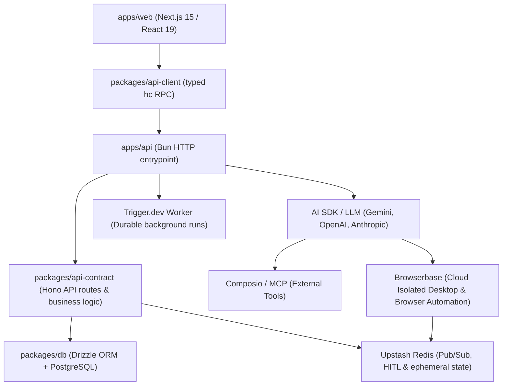

# OpenBots Codebase Knowledge Map

This document synthesizes the core architectural concepts, package boundaries, data models, and execution lifecycles of **OpenBots** in a high-density, token-efficient structure.

---

## 1. System Overview

**OpenBots** is an open-source autonomous multi-agent platform for building, orchestrating, and operating AI agent workflows. It features:
- Dual-mode execution (direct streaming via Bun HTTP or durable background jobs via Trigger.dev).
- Cloud Isolated Desktop & headless browser automation (Browserbase) with live interactive debugging and Human-in-the-Loop (HITL) handoffs.
- Multi-provider model routing (Google Gemini, OpenAI, Anthropic).
- SaaS integrations via Composio & Model Context Protocol (MCP).
- Persistent conversation and execution telemetry (runs and run steps).
- Supabase storage for multimodal vision/attachments.

---

## 2. Monorepo Structure (`Bun Workspaces + Turborepo`)

| Package / App | Path | Role & Boundaries |
|---|---|---|
| **`apps/web`** | `apps/web/` | Next.js App Router (React 19, Tailwind v4). Dashboard, agent management, chat, settings. Never directly imports `@openbots/db` or `apps/api`. |
| **`apps/api`** | `apps/api/` | Thin Bun HTTP server entrypoint + Trigger.dev task declarations + agent execution loop (`executeAgentRun`). |
| **`packages/api-contract`** | `packages/api-contract/` | Hono app instance, route definitions, Zod validation schemas, business logic layers, Better Auth integration. Server-only. |
| **`packages/api-client`** | `packages/api-client/` | Browser-safe typed RPC client powered by Hono Client (`hc<AppType>`). Used by `apps/web`. |
| **`packages/db`** | `packages/db/` | Drizzle ORM schema definitions, PostgreSQL connection, Redis client, Supabase storage utilities, migrations. Server-only. |
| **`packages/ui`** | `packages/ui/` | Shared UI components (Tailwind v4, Radix/Base UI primitives, icons). |
| **`packages/typescript-config`** | `packages/typescript-config/` | Shared TypeScript configurations across the workspace. |

---

## 3. Core Database Schemas (`packages/db/src/schemas/`)

- **`auth.ts`**: Better Auth tables (`user`, `session`, `account`, `verification`).
- **`agents.ts`**: Agents config (`id`, `userId`, `name`, `systemPrompt`, `model`, `status`, `autonomy`, `metadata`).
- **`agent-tools.ts`**: Tool bindings per agent (`agentId`, `toolName`, `provider`: `internal` | `composio` | `mcp`, `config`).
- **`connections.ts`**: External OAuth connections via Composio (`userId`, `provider`, `connectionId`, `status`).
- **`conversations.ts`**: Sessions between user and agent (`id`, `userId`, `agentId`, `title`).
- **`messages.ts`**: Chat history (`conversationId`, `role`: `system` | `user` | `assistant` | `tool`, `content`, `attachments`).
- **`runs.ts`**: Execution instances (`id`, `agentId`, `conversationId`, `status`: `queued` | `running` | `completed` | `failed`, `triggerType`).
- **`run-steps.ts`**: Granular telemetry of every model reasoning cycle and tool invocation (`runId`, `stepNumber`, `type`: `model` | `tool`, `input`, `output`, `status`).
- **`schedules.ts`**: Scheduled and cron-based agent executions.
- **`user-api-keys.ts`**: User-supplied BYOK API keys (encrypted/stored per provider).

---

## 4. Agent Execution Flow

1. **Triggering**: A run is triggered via interactive chat (`POST /api/conversations/:id/messages`) or background schedule.
2. **Execution Selection**:
   - **Interactive Fast-Path**: API server registers `registerDirectRunExecutor` which streams reasoning steps directly via in-process `ToolLoopAgent` (`apps/api/src/agent/execute.ts`).
   - **Background Durable Path**: Dispatched to Trigger.dev (`apps/api/src/trigger/agent-run.ts`) with retry semantics, failure resilience, and locking (`UPDATE runs SET status = 'running' WHERE id = ... AND status = 'queued'`).
3. **Model Resolution**: `resolveModel` resolves the API key (user BYOK or fallback env variables) and instantiates the AI SDK provider (`@ai-sdk/google`, `@ai-sdk/openai`, or `@ai-sdk/anthropic`).
4. **Tool Resolution**:
   - Internal tools (`web_search`, `calculate`, `http_request`, `execute_code`, `dns_lookup`, etc.).
   - Cloud Isolated Desktop tools via Browserbase (`browser_navigate`, `browser_click`, `browser_type`, `browser_wait_for_user`, `browser_screenshot`, `browser_evaluate`, etc.).
   - SaaS tools via Composio (`@composio/core` & `@composio/vercel`).
   - Custom MCP servers.
5. **Telemetry & Artifacts**: Steps are persisted in `run_steps` and emitted via `runEventHub` / `agentEventHub` to the UI. Live browser views and HITL requests are synchronized in Redis.

---

## 5. Security & Invariant Rules

1. **Layer Separation**: `apps/web` must **never** import `@openbots/db` or secret env vars.
2. **Thin API Server**: `apps/api` contains only bootstrapping and runtime hooks; HTTP routes and validation belong in `packages/api-contract`.
3. **Sanitization**: API keys and secrets in run traces are masked before database persistence.
4. **Strict Concurrency**: Runs use atomic state updates to prevent duplicate execution across workers.
