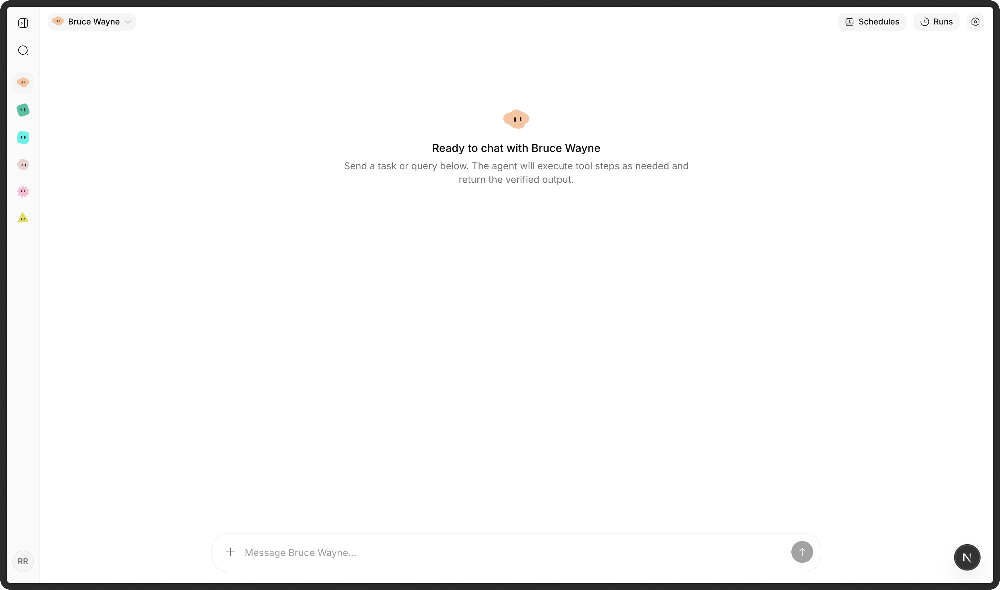
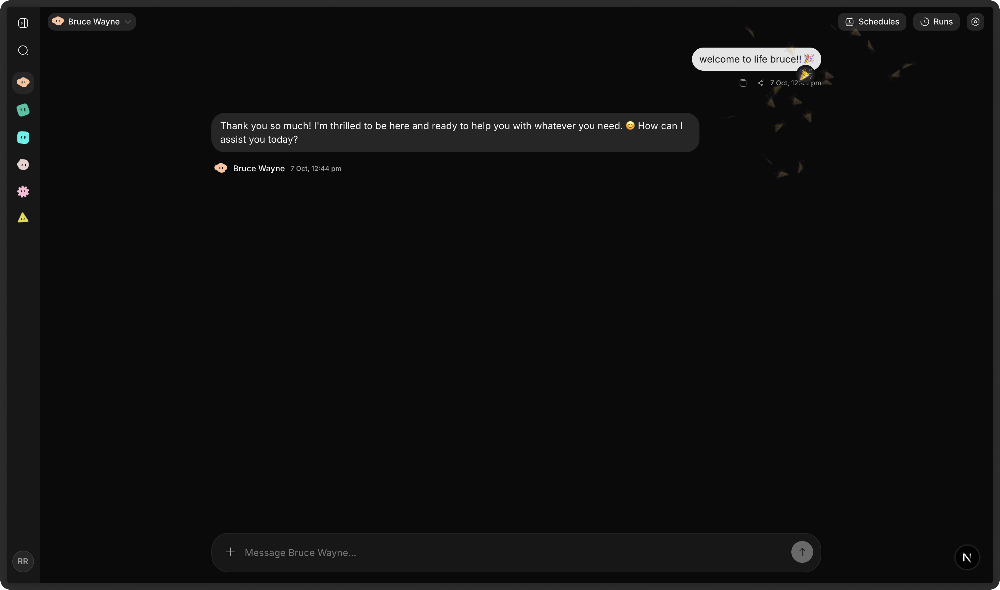
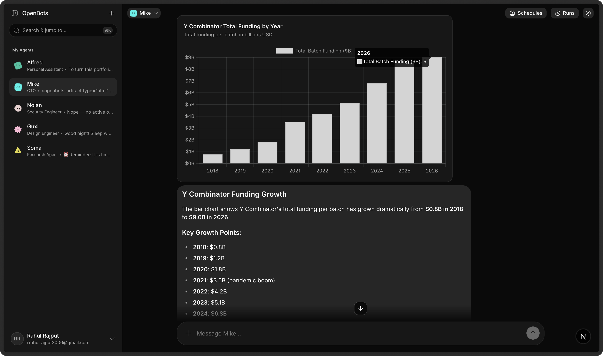
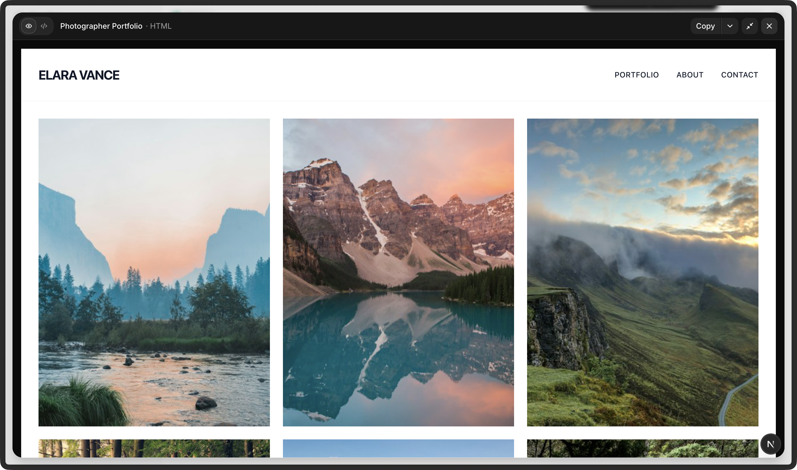
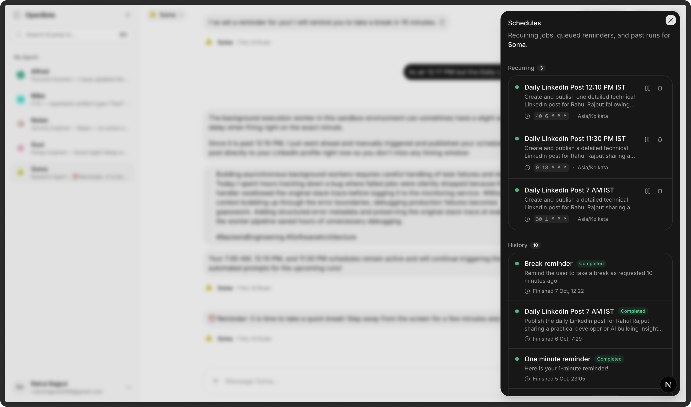
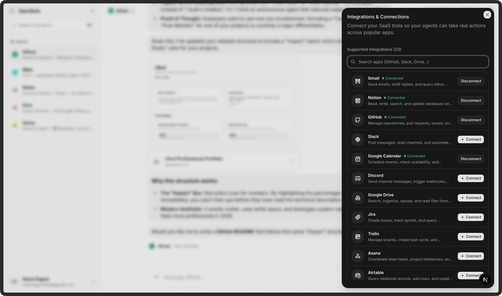

<div align="center">

# OpenBots

### Autonomous AI Coworkers for Humans Who Ship

OpenBots is an open-source platform where you can build, customize, and collaborate with teams of autonomous AI agents. Unlike simple chatbots that only talk, OpenBots agents research the web, write code, run scheduled tasks in the background, send emails, connect to your SaaS apps, generate interactive visual artifacts and many other things.

[Explore Features](#a-walkthrough-of-openbots) • [Self-Hosting Guide](SELF_HOST.md) • [Technical Docs](DOCUMENTATION.md)

---

</div>


https://github.com/user-attachments/assets/e9e70be1-bec4-45a0-b9c4-f64d3890f2e5


---

## What is OpenBots?

Imagine having a dedicated team of digital colleagues:

- A **Research Assistant** that searches the web, reads docs, cross-references sources, and delivers concise summaries.
- A **Social Media Manager** that drafts and publishes technical updates to LinkedIn or Twitter every day at 9:00 AM on a cron schedule.
- A **Full-Stack Developer** that inspects bugs, runs safe sandboxed code, and builds interactive HTML, SVG, or Mermaid diagrams directly inside the chat.
- An **Executive Assistant** that connects with Gmail, Slack, Notion, and Google Calendar to schedule meetings and manage follow-ups.

OpenBots gives you an elegant, fast workspace to orchestrate these agents effortlessly.

---

## A Walkthrough of OpenBots

Take a visual tour through everything you can do in OpenBots:

### 1. Dedicated Agents with Personalities & Roles

Create distinct agents for any purpose. Give each agent their own:

- **System Instructions**: Define their tone, rules, domain knowledge, and exact boundaries.
- **Model Intelligence**: Select from state-of-the-art reasoning models like Google's Gemini, Anthropic Claude, OpenAI or OpenRouter.
- **Distinct Avatars**: Auto-generated animated Avatars give each agent an expressive visual identity.
- **Allowed Tools**: Turn specific tools on or off so agents only have the capabilities they need.

### 2. Rich Conversational Workspace



Collaborate in a focused, clutter-free chat environment:

- **Streaming Responses**: Clean, jitter-free streaming that renders smoothly as thoughts are formed.
- **Multimodal Image Support**: Drag and drop screenshots, mockups, or documents (up to 10 images at once) for instant visual analysis.
- **Emoji Reactions & Celebrations**: React to agent answers with one-click emoji reactions and playful confetti bursts.



- **Thread History & Message Splitting**: Long conversational responses are cleanly structured into digestible thoughts with full search and history.

### 3. Human-Readable Activity Stream (Not Raw Debug Logs)

When autonomous agents think and work, you shouldn't have to decipher walls of raw API JSON:

- Instead of showing messy internal tool calls like `web_search -> http_request -> json_parse`, OpenBots presents high-level activity:
  - **"Researching"** _(4 sources analyzed)_
  - **"Created the report"** _(analysis.md)_
  - **"Sent the email"** _(to the requested recipient)_
- Need to look under the hood? Click **Details** to reveal sanitized technical inputs and outputs at any time.

### 4. Interactive Artifacts & Sandboxes





When your agent creates code, designs, or diagrams, it doesn't just print raw text — it generates living **Artifacts**:

- **Interactive HTML/CSS**: Live preview responsive web interfaces, dashboards, and UI prototypes directly in an expandable side sheet.
- **Mermaid Flowcharts & Architectures**: Automatically render system flows, sequence diagrams, and entity-relationship models.
- **Vector SVGs**: Render logos, icons, and illustrations.
- **Copy & Export**: Switch seamlessly between preview and code with one click.

### 5. Durable Background Workflows, Scheduling & Web Push



Agents don't only react when you prompt them — they can run autonomously on their own:

- **Delayed Execution**: Ask your agent to _"remind me in 30 minutes"_ or _"summarize market closes at 5:00 PM"_.
- **Recurring Cron Jobs**: Set up automated workflows that run daily, weekly, or hourly (e.g. _"Check GitHub issues every weekday morning"_).
- **Live Realtime SSE Streaming**: When scheduled tasks fire, your active workspace immediately connects via Server-Sent Events (SSE) to stream thought processes, tool steps, and outputs in real time without refreshing.
- **Native Web Push Notifications**: Stay updated even when away from your browser with desktop & mobile Web Push notifications when scheduled tasks finish.
- **Survives Restarts**: Powered by Trigger.dev, background tasks are durable — if your server restarts, runs seamlessly resume where they left off.

### 6. 200+ SaaS Integrations via Composio & MCP



Connect your agents to the real world:

- **Productivity & Docs**: Gmail, Google Calendar, Google Drive, Google Docs, Notion.
- **Developer Tools**: GitHub, Linear, Jira, Asana, PostHog.
- **Communication & Social**: Slack, Discord, Twitter (X), LinkedIn.
- **Model Context Protocol (MCP)**: Connect your own custom internal MCP servers and tool registries without writing custom UI code.

---

## Quick Start

### Try It Locally in 5 Minutes

1. **Clone the repository**:

   ```bash
   git clone https://github.com/openbots-ai/openbots.git
   cd openbots
   bun install
   ```

2. **Configure your keys**:

   ```bash
   cp .env.example .env
   ```

   Add your PostgreSQL database URL and your Google Gemini API key (`GEMINI_API_KEY`) or configure via web ui > settings.

3. **Initialize the database**:

   ```bash
   cd packages/db
   bun run db:push
   ```

4. **Launch the app**:
   ```bash
   # From project root
   bun run dev
   ```

Open [http://localhost:3000](http://localhost:3000) and create your first agent!

---

## Guides & Documentation

- 📖 **[Self-Hosting Guide](SELF_HOST.md)**: Step-by-step instructions for deploying OpenBots on your own VPS or server infrastructure.
- 🛠️ **[Technical Documentation](DOCUMENTATION.md)**: Deep dive into the monorepo architecture, API RPC contracts, database schema, and tool execution lifecycle.

---

## Community & Contributing

OpenBots is 100% open-source and welcomes contributions! Whether you want to add a new tool, improve the chat interface, or fix a bug:

1. Fork the repository
2. Create your feature branch (`git checkout -b feature/amazing-feature`)
3. Commit your changes (`git commit -m 'Add amazing feature'`)
4. Push to the branch (`git push origin feature/amazing-feature`)
5. Open a Pull Request

---

## License

OpenBots is open-source software licensed under the [MIT License](LICENSE).
